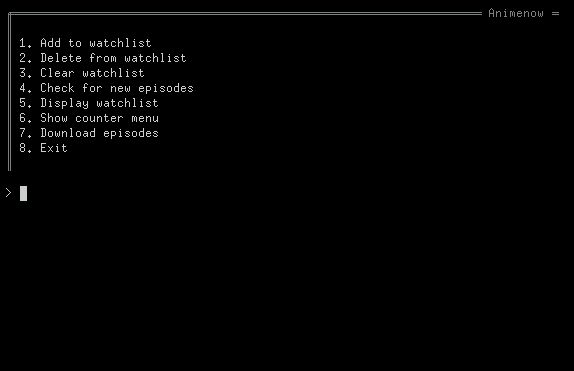

# Animenow

###### Animenow is an application that lets you manage the on-going anime you watch all through your terminal !



## With Animenow you can:
- Create a watchlist of all the on-going anime you watch.
- Check for new episodes of all the shows in your watchlist.
- Maintain an episode counter for each show in your watchlist.
- Download the next episode of a show in your counter.

## Requirements:
- Python3 with pip3 ( may already come with your distribution ).
- BeautifulSoup4 python library.
- Termcolor python library.
- A linux terminal.

## Installation:
```
git clone https://github.com/dxmxnlord/animenow.git
cd animenow
make
sudo make install
```
## Use: 
- lauch Animenow by using the command.
```
animenow
```
You can:
- Maintain you watchlist. This also makes sure the show is a part of [Horriblesubs' Releases](https://horriblesubs.info/current-season/).
- Check for new episodes from your watchlist. This needs access to [nyaa](nyaa.si). This automatically updates your watchlist with the latest episode number as well.
- Download the next episode for an anime from your anime counter as a torrent ( only horriblesubs ). Again, access to [nyaa](nyaa.si) is needed.
- Manage episode counters for every show you watch.

## Uninstalling:
```
git clone https://github.com/dxmxnlord/animenow.git
cd animenow
make
sudo make uninstall
```

###### Thanks for checking this out !

